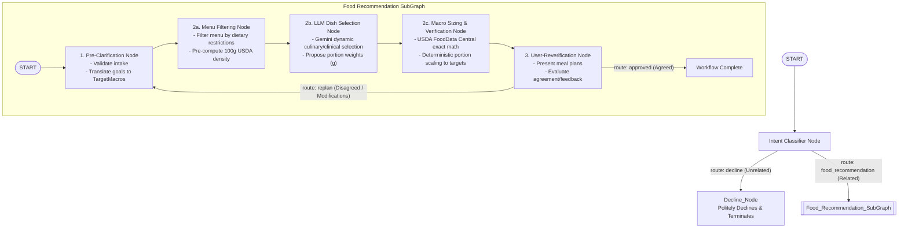

# Nutrition Specialist Graph Workflow Agent (ADK 2.0)

A graph-based AI agent workflow developed with **Google ADK 2.0** for a corporate **Nutrition Specialist** in Singapore. The agent gathers user nutritional goals, queries the USDA FoodData Central database to compute precise caloric and macronutrient breakdowns, provides targeted dish recommendations across Singapore corporate canteens (**Shiok** and **StrEAT**), and iterates through human feedback via graph replanning loops.

---

## 🏗️ Graph Architecture & Workflow Topology



---

## 📊 State Schema

The workflow state is defined in [`app/state.py`](file:///usr/local/google/home/sherrywuyujin/ai-in-5-days/app/state.py) using Pydantic:

| State Variable | Type | Description |
| :--- | :--- | :--- |
| `canteen_preference` | `Optional[str]` | Preferred canteen: `'Shiok'` (Floor 7), `'StrEAT'` (Floor 30), or `'Both'`. |
| `nutrition_goal` | `Optional[NutritionGoalType]` | Must map to one of: `['No Specific', 'Low GI', 'Cut Down Body Fat', 'High Protein for Muscle Gain']`. |
| `target_macros` | `Optional[TargetMacros]` | Internal translation into max calories, min protein, carbs, fat, fiber. |
| `dietary_restrictions`| `Optional[List[str]]` | Dietary constraints (e.g. halal, no-pork, vegan, celiac/gluten-free). |
| `filtered_menu_items`| `Optional[Dict]` | Intermediate state: menu items filtered by dietary restrictions with 100g density. |
| `llm_candidate_plans`| `Optional[Dict]` | Intermediate state: raw candidate dish selection & proposed portions from LLM. |
| `suggested_meal_plans`| `Optional[List[MealCombination]]` | Output from planning node (max 2 combinations per canteen with portion in grams). |
| `user_feedback` | `Optional[str]` | Any disagreement or modifications requested during reverification. |

---

## 🧩 Nodes & SubGraphs

### 1. Intent Classifier Node (`app/nodes/classifier.py`)
- Evaluates user query intent.
- If unrelated to food recommendations in Singapore: Routes to `Decline_Node`.
- If related: Routes to `Food_Recommendation_SubGraph`.

### 2. Decline Node (`app/nodes/classifier.py`)
- Politely explains that the specialist is exclusively dedicated to Singapore corporate canteen food and nutrition planning, then terminates the flow.

### 3. Pre-Clarification Node (`app/nodes/pre_clarification.py`)
- Gathers missing intake parameters (`canteen_preference`, `nutrition_goal`, `dietary_restrictions`).
- Translates `nutrition_goal` into precise target macros:
  - **Cut Down Body Fat:** $\le 550$ kcal, $\ge 35$g protein, $\le 45$g carbs, $\le 15$g fat.
  - **High Protein for Muscle Gain:** $\le 850$ kcal, $\ge 50$g protein, $\le 80$g carbs.
  - **Low GI:** $\le 600$ kcal, $\ge 30$g protein, $\ge 12$g fiber (low glycemic index whole grains/greens).
  - **No Specific:** Balanced HPB healthy plate standard ($\approx 650$ kcal, $\ge 25$g protein).

### 4. Planning Nodes Pipeline (`app/nodes/planning.py`)
- **`menu_filtering_node`**: Filters live day-menu (`menu.json`) by `canteen_preference` and `dietary_restrictions` and computes 100g USDA baseline density.
- **`llm_dish_selection_node`**: Leverages Gemini LLM innate culinary & clinical nutrition capability to dynamically pick 1-2 complementary meal combinations per canteen from real day dishes.
- **`macro_sizing_and_verification_node`**: Anti-hallucination check + exact USDA FoodData Central calculations ([`app/tools/usda_tool.py`](file:///usr/local/google/home/sherrywuyujin/ai-in-5-days/app/tools/usda_tool.py)), deterministically scaling portion weights (g) so calories stay below `max_calories_kcal` and protein hits `min_protein_g`.

### 5. User-Reverification Node (`app/nodes/reverification.py`)
- Presents the suggested meal plans to the user.
- **Routing Logic:**
  - **If the user agrees:** Concludes the workflow with route `'approved'`.
  - **If the user disagrees / has modifications:** Updates `user_feedback` in state and routes to `'replan'` (`llm_dish_selection_node`) to dynamically re-select dishes or update portion sizes.

---

## 🧪 Testing

Run the automated test suite with `pytest`:

```bash
uv run pytest
```
