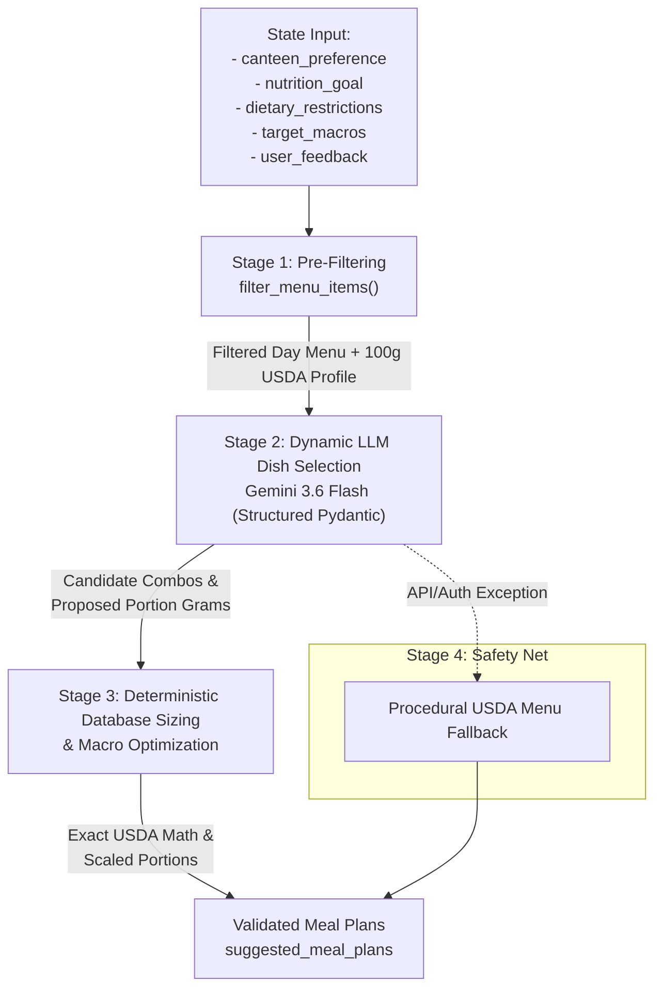

# Planning Node Design: Hybrid LLM Menu Design & Deterministic Macro Sizing

This document describes the architectural design of the **Planning Node** (`app/nodes/planning.py`) in the Google ADK 2.0 Nutrition Specialist Agent. Rather than using hardcoded dish templates for each `nutrition_goal`, the node combines **deterministic menu pre-filtering**, **LLM-driven culinary and dietetic menu design**, and **USDA database-backed deterministic portion sizing and macro scaling**.

---

## 🏛️ Three-Stage Hybrid Pipeline



---

## 🔍 Detailed Stage Breakdown

### Stage 1: Pre-Filtering by Dietary Restrictions & Canteen (`filter_menu_items`)
Before invoking any generative model, the node executes a deterministic filtering step against the live canteen menu (`menu.json`):
1. **Facility Scope:** Selects dishes from `'Shiok'` (Floor 7), `'StrEAT'` (Floor 30), or both based on `canteen_preference`.
2. **Dietary Constraint Enforcement:** Filters out any menu item violating the user's `dietary_restrictions` (e.g., `'halal'`, `'vegan'`, `'vegetarian'`, `'no pork'`).
3. **Nutritional Enrichment:** Computes baseline 100g macro profiles (calories, protein, carbs, fat, fiber) via the USDA FoodData Central estimator (`estimate_dish_nutrition`) so the LLM has exact relative caloric and macronutrient density data when making culinary decisions.

---

### Stage 2: Dynamic LLM Culinary & Dietetic Dish Selection
Rather than relying on static `if/elif` templates, the node leverages the LLM's innate culinary, pairing, and clinical nutrition knowledge to design meal plans from the filtered menu:

- **Prompt Context:** Provides the LLM with the user's explicit `nutrition_goal` (e.g., `'High Protein for Muscle Gain'`, `'Cut Down Body Fat'`, `'Low GI'`, `'No Specific'`), their numerical `target_macros` budget, and any iterative `user_feedback` from previous reverification rounds.
- **Selection Capabilities:**
  - Pairs complementary items from the day's stations (e.g., pairing lean steamed fish/pork/poultry with high-fiber greens and low-glycemic complex carbohydrates/soups).
  - Respects the constraint of **maximum 2 combinations per canteen** (up to 4 combinations if both canteens are selected).
  - Proposes candidate portion sizes in grams (`portion_grams`) and generates a scientific clinical rationale explaining why the selected pairing supports the user's goals.
- **Structured Output Schema:**
  ```python
  class CandidateDish(BaseModel):
      name: str = Field(description="Exact name of the dish from the provided menu.")
      portion_grams: float = Field(description="Proposed portion size in grams.")

  class CandidateCombination(BaseModel):
      canteen_name: str
      combination_title: str
      dishes: List[CandidateDish]
      nutritional_rationale: str

  class CandidateMealPlans(BaseModel):
      combinations: List[CandidateCombination]
  ```

---

### Stage 3: Deterministic Database Sizing & Macro Verification (`_verify_and_scale_candidate_combination`)
To eliminate LLM arithmetic hallucinations and ensure 100% adherence to USDA FoodData Central calculations and user target budgets, every candidate combination undergoes strict mathematical post-processing:

1. **Anti-Hallucination Menu Mapping:** Re-verifies that every candidate dish name exists on today's filtered menu.
2. **Exact USDA Macro Calculation:** Invokes `estimate_dish_nutrition(dish.name, dish.ingredients, portion_grams)` to obtain exact calorie, protein, carbohydrate, fat, and fiber sums.
3. **Automatic Portion Scaling / Optimization:**
   - **Caloric Ceiling Enforcement (`Cut Down Body Fat`, `Low GI`):** If total calories exceed `max_calories_kcal`, deterministically scales portion sizes down by `scale_factor = (max_calories_kcal - buffer) / total_calories`.
   - **Protein Floor Enforcement (`High Protein for Muscle Gain`):** If total protein is below `min_protein_g`, scales portion sizes up (or boosts high-protein items) so `total_protein >= min_protein_g`.
4. **Final Math Verification:** Re-runs USDA estimates at the scaled portion weights to guarantee exact arithmetic sums across all reported macro fields.

---

### Stage 4: Offline / Resiliency Fallback
If the LLM service is unavailable, unauthenticated, or returns invalid schema, the node smoothly falls back to `_generate_fallback_combinations`, ensuring the ADK graph workflow always produces structured meal recommendations.
