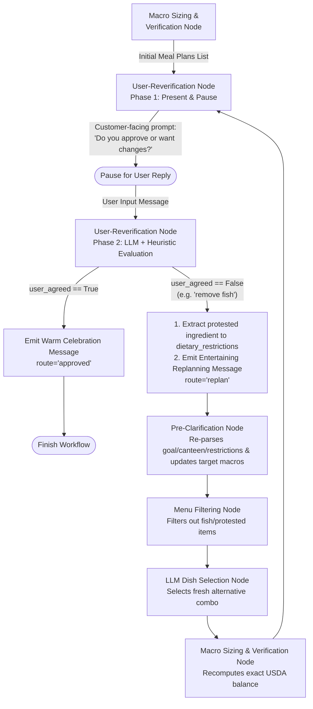

# User-Reverification & Replanning Design: Interactive Human-in-the-Loop Feedback

This document describes the architectural design of the **User-Reverification Node** (`app/nodes/reverification.py`) and the replanning loop in the Google ADK 2.0 Nutrition Specialist Agent (`Food_Recommendation_SubGraph`).

---

## 🛑 Limitations of the Previous Reverification Flow
1. **Automatic Approval Without Confirmation:** Previously, when `user_reverification_node` received the initial list of meal plans from the planning node, it immediately emitted `route="approved"`, bypassing human review.
2. **Silent Replanning & Missing Ingredient Filtering:** When a user protested or requested a change (e.g., *"remove the fish"* or *"I don't like tofu"*), the node routed to `replan` without giving the user an entertaining, reassuring customer-facing response while the graph recomputed. Moreover, the protested ingredient needed to be added to `dietary_restrictions` so the pre-filtering node (`menu_filtering_node`) removes it from the menu pool.

---

## 🏛️ Redesigned Interactive Reverification & Replanning Topology

---

## 🔍 Two-Phase Reverification Execution

### Phase 1: Presentation & Interactive Confirmation Pause
When `user_reverification_node` receives the newly generated meal plan list from `macro_sizing_and_verification_node`:
- **State Marker:** Checks whether `plan_presented_for_verification` is `True` for the current combination generation round.
- **Customer-Facing Engagement Message:** Emits a clear, welcoming interactive prompt asking for explicit confirmation:
  > *"👨‍🍳 Your personalized Singapore Canteen Meal Plans are ready above!\n\nTake a look at the exact USDA macro breakdowns and portion weights. **Do these dishes look good to confirm, or would you like to swap any items out (e.g., remove fish, change portion sizes, switch canteens)?**"*
- **Pause Workflow Turn:** Does **not** emit `route="approved"` or `route="replan"`. Instead, yields the message without a route so ADK pauses the conversation turn, waiting for the user's explicit reply.

---

### Phase 2: Feedback Evaluation, Entertaining Re-Engagement & Dynamic Replanning
When the user replies to the confirmation prompt:
1. **Decision Classification (`ReverificationDecision`):**
   - Evaluates whether the user approved (`user_agreed: True`) or protested/requested adjustments (`user_agreed: False`).
2. **When Approved (`user_agreed == True`):**
   - Emits a warm final customer-facing confirmation message and routes to `'approved'`.
3. **When Protested / Disagreed (`user_agreed == False`):**
   - **Ingredient / Allergen Protest Extraction:** Parses the user's feedback for specific food protests (e.g., `"fish"`, `"seafood"`, `"pork"`, `"tofu"`, `"spicy"`, `"chicken"`) and appends any protested items directly to `ctx.state["dietary_restrictions"]`.
   - **Entertaining Customer-Facing Replanning Update:** Emits an engaging, conversational message so the user knows exactly what the AI chef is doing behind the scenes:
     > *"Heard loud and clear! 🚫 Removing fish from your menu options! Sending our AI chef back into the Singapore canteen kitchen to whip up a fresh alternative dish, recalculate exact USDA gram portions, and re-balance your target macros. One moment..."*
   - **SubGraph Routing (`route="replan"`):** Routes back to **`menu_filtering_node`** so Stage 1 filters the protested ingredient out of `menu.json`, Stage 2 selects a fresh dish pairing, and Stage 3 deterministically verifies and re-scales portion weights.
