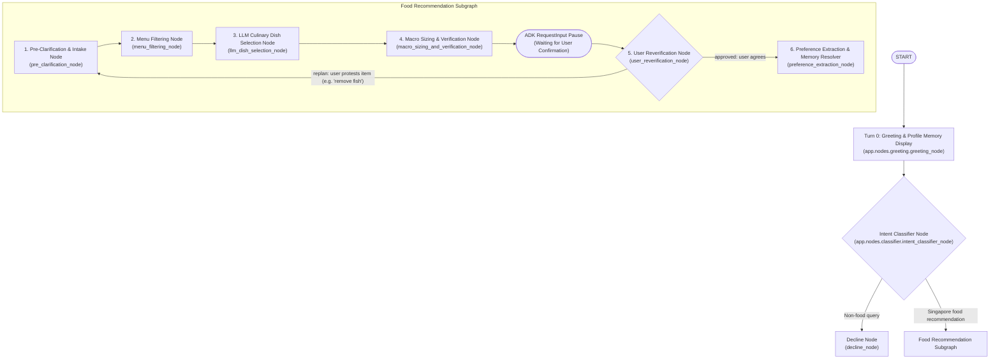

# Singapore Corporate Canteen AI Specialist: Architectural Specification (v0)

This document specifies the features, graph topology, node responsibilities, and components of the **Google ADK 2.0 Graph Workflow Nutrition Specialist Agent** as of the `v0` release (commit `0d4856a3`).

---

## 🌟 Overview
The **Singapore Corporate Canteen Nutrition Specialist** is a multi-turn, multi-tenant agent built for Googlers dining at **MBC2 Floor 7 (Shiok!)** and **MBC2 Floor 30 (StrEAT)**.

### Core v0 Capabilities:
1. **Live Daily Menu Ingestion (`today_menu.json` / `menu.json`)**
2. **Deterministic USDA FoodData Central Gram-Portion Scaling & Macro Balancing (`app/tools/usda_tool.py`)**
3. **Interactive Human-in-the-Loop (HITL) Confirmation via ADK 2.0 `RequestInput`**
4. **LLM Transient vs. Permanent Multi-Tenant Profile Memory Resolution (`user_profiles.json`)**
5. **Interactive Multi-Tenant Web Portal & Canteen Admin Live Menu Editor (`web/server.py`)**

---

## 🏛️ Graph Topology & Workflow Architecture



---

## 🔍 Detailed Node Specifications

### 1. Turn 0 Greeting & Profile Memory Display (`greeting_node`)
- **Zero-LLM Startup:** Reads the user's saved preferences from multi-tenant memory (`user_profiles.json`).
- **Memory Presentation:** Displays preferred canteen (`Shiok`/`StrEAT`), default goal, and avoided restrictions.
- Yields `RequestInput` so the user can confirm their saved profile or request modifications.

### 2. Intent Classifier (`intent_classifier_node`)
- Classifies queries into `food_recommendation` or `decline`.
- **Continuity Protection:** If `suggested_meal_plans` or `canteen_preference` is present in state, continuation messages (e.g., `"looks good to me"`, `"swap rice"`) bypass decline and route directly to `food_recommendation`.

### 3. Pre-Clarification & Typo Intake (`pre_clarification_node`)
- Extracts clinical goals (`High Protein`, `Cut Down Body Fat`, `Low GI`, `No Specific`), canteen preferences, and restrictions.
- **Typo Resilience:** Corrects misspellings (e.g., `"pretain"` $\rightarrow$ `"High Protein for Muscle Gain"`, `"MBC 30"` $\rightarrow$ `"StrEAT"`).
- **Negation Handling:** Detects negated restrictions (e.g., `"hi i am not a vegan"`, `"remove fish"`) and removes them from active state and long-term memory.
- Translates goals into strict numerical target macronutrient budgets (`target_macros`).

### 4. Menu Filtering (`menu_filtering_node`)
- Filters live daily canteen menus against allergens, ingredient tokens, and dietary flags (`vegan`, `vegetarian`, `halal`, `dairy-free`, `gluten-free`, `no pork`, `no seafood`).
- Enriches eligible dishes with baseline 100g USDA nutrient breakdowns.

### 5. Dynamic LLM Culinary Pairing (`llm_dish_selection_node`)
- Uses `gemini-3.7-flash` to synthesize cohesive culinary pairings (main protein, sides/greens, soups/grains) from filtered stations.
- Produces candidate combinations with proposed gram portion weights and clinical nutritional rationales.

### 6. Deterministic USDA Portion Sizing & Verification (`macro_sizing_and_verification_node`)
- Calculates exact macro totals using official USDA FoodData Central dataset tables (`fdc.nal.usda.gov`).
- **Deterministic Scaling:** Scales calories down if exceeding `max_calories_kcal`; scales protein portions up if below `min_protein_g`.
- Formats markdown meal cards with dish breakdown tables, gram weights, kcal, protein, carbs, fat, and fiber.
- **Human-in-the-Loop Confirmation:** Yields `RequestInput(...)` at the end of the node to pause graph execution for explicit user confirmation.

### 7. User Reverification & Interactive Replanning (`user_reverification_node`)
- Single-phase feedback evaluator when session resumes from `RequestInput`.
- **Approval (`user_agreed: True`):** Routes to `preference_extraction_node`.
- **Protest / Modifications (`user_agreed: False`):**
  - Extracts protested ingredients (e.g. `"fish"`, `"tofu"`) directly into `dietary_restrictions`.
  - Emits a customer-facing replanning message.
  - Routes to `replan` (returning to `pre_clarification_node` and `menu_filtering_node` to regenerate meal plans without the protested ingredient).

### 8. LLM Transient vs. Permanent Memory Resolver (`preference_extraction_node`)
- Employs structured LLM decision schema (`MemoryResolutionDecision`) to distinguish transient today-only choices from permanent profile memory updates.
- Persists confirmed long-term preferences to `user_profiles.json`.

---

## 🛠️ Tooling & Infrastructure Modules (v0)

| Module | Location | Purpose |
| :--- | :--- | :--- |
| **USDA Tool** | `app/tools/usda_tool.py` | USDA FoodData Central dataset querying and deterministic portion scaling (g). |
| **Menu Tool** | `app/tools/menu_tool.py` | Live JSON menu lookup, canteen normalization, and allergen filtering. |
| **Preference Memory** | `app/tools/preference_memory.py` | Multi-tenant persistent user profile store (`user_profiles.json`). |
| **LLM Utility** | `app/utils/llm.py` | Google GenAI client initialization with Vertex AI / API Key auto-detection. |
| **Web Server** | `web/server.py` | FastAPI server hosting consultation endpoint and Canteen Admin live menu portal. |
| **Frontend UI** | `web/static/index.html` | Multi-tenant consultant chat UI, macro progress bars, HITL buttons, and live JSON editor. |

---

## 🚀 Execution Commands (v0)

- **Run Automated Test Suite (17 Tests):**
  ```bash
  PYTHONPATH=. .venv/bin/python -m pytest -v tests/
  ```
- **Launch Interactive Web Portal & Admin Portal:**
  ```bash
  .venv/bin/python -m uvicorn web.server:app --host 127.0.0.1 --port 8000 --reload
  ```
- **Launch ADK 2.0 Dev UI:**
  ```bash
  uv run adk dev
  ```
